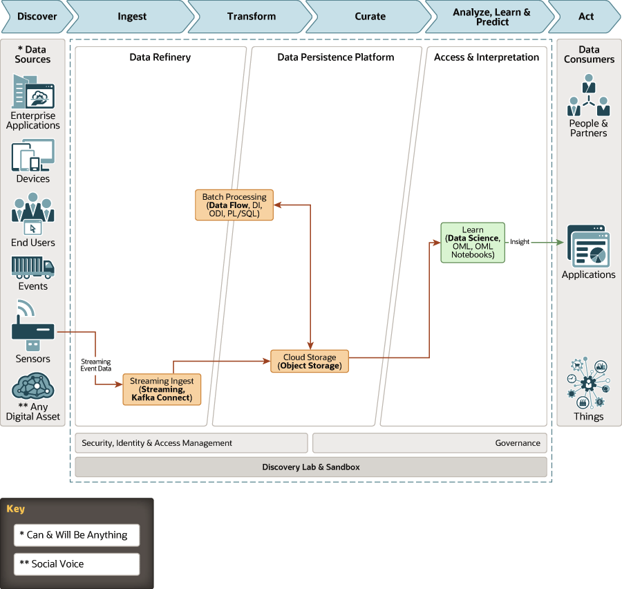

# streaming-data-science

This architecture uses Oracle Streams for ingesting continuous, high-volume streams of data into object storage through an integration made with Oracle's Service Connector Hub.

This data can then be leveraged with Oracle Data Science. Oracle Data Science is used to build, train, and manage machine learning (ML) models in Oracle Cloud Infrastructure.

Data Flow is used to run your Apache Spark applications.

## Prerequisites

- Permission to `manage` the following types of resources in your Oracle Cloud Infrastructure tenancy: `vcns`, `nat-gateways`, `route-tables`, `subnets`, `service-gateways`, `security-lists`, `stream`, `stream-pull`, `stream-push`, `stream-pools`, `serviceconnectors`, `dataflow-family`, and `functions-family`.

- Quota to create the following resources: 1 VCN, 1 subnet, 1 Internet Gateway, 1 NAT Gateway, 1 Service Gateway, 2 route rules, 1 stream/stream pool, 1 Fn App, 1 Fn Function, 2 Buckets, 1 Data Flow App, 1 Data Science Project/Notebook and 1 Service Connector Hub.

If you don't have the required permissions and quota, contact your tenancy administrator. See [Policy Reference](https://docs.cloud.oracle.com/en-us/iaas/Content/Identity/Reference/policyreference.htm), [Service Limits](https://docs.cloud.oracle.com/en-us/iaas/Content/General/Concepts/servicelimits.htm), [Compartment Quotas](https://docs.cloud.oracle.com/iaas/Content/General/Concepts/resourcequotas.htm).


## Deploy Using Oracle Resource Manager

**Note**: A set of policies and two dynamic groups are created in this Resource Manager stack allowing an administrator to deploy this solution. These are listed in "policies.tf" file and can be used as a reference when fitting this deployment to your specific IAM configuration.

1. Click [](https://cloud.oracle.com/resourcemanager/stacks/create?region=home&zipUrl=https://github.com/Carl-Lejerskar/oci-arch-adw-oac/releases/download/v0.1/streaming-data-science.zip)

    If you aren't already signed in, when prompted, enter the tenancy and user credentials.

2. Review and accept the terms and conditions.

3. Select the region where you want to deploy the stack.

4. Follow the on-screen prompts and instructions to create the stack.

5. After creating the stack, click **Terraform Actions**, and select **Plan**.

6. Wait for the job to be completed, and review the plan.

    To make any changes, return to the Stack Details page, click **Edit Stack**, and make the required changes. Then, run the **Plan** action again.

7. If no further changes are necessary, return to the Stack Details page, click **Terraform Actions**, and select **Apply**. 

8. Navigate to your Service Connector Hub Instance (Analytics & AI -> Messaging -> Service Connector Hub).
   
9.  Click "Edit":
   

11. Scroll down the page and click the three create buttons for the policies required for the Service Connector Hub: 
    

## Deploy Using Oracle Resource Manager

## Terraform Provider for Oracle Cloud Infrastructure
The OCI Terraform Provider is now available for automatic download through the Terraform Provider Registry. 
For more information on how to get started view the [documentation](https://www.terraform.io/docs/providers/oci/index.html) 
and [setup guide](https://www.terraform.io/docs/providers/oci/guides/version-3-upgrade.html).

* [Documentation](https://www.terraform.io/docs/providers/oci/index.html)
* [OCI forums](https://cloudcustomerconnect.oracle.com/resources/9c8fa8f96f/summary)
* [Github issues](https://github.com/terraform-providers/terraform-provider-oci/issues)
* [Troubleshooting](https://www.terraform.io/docs/providers/oci/guides/guides/troubleshooting.html)

## Clone the Module
Now, you'll want a local copy of this repo. You can make that with the commands:

    git clone https://github.com/oracle-quickstart/oci-arch-adw-oac
    cd oci-arch-adw-oac/odi-data-science
    ls

## Prerequisites
First off, you'll need to do some pre-deploy setup.  That's all detailed [here](https://github.com/cloud-partners/oci-prerequisites).

Additionally you'll need to do some pre-deploy setup for Docker and Fn Project inside your machine:

```
sudo su -
yum update
yum install yum-utils
yum-config-manager --enable *addons
yum install docker-engine
groupadd docker
service docker restart
usermod -a -G docker opc
chmod 666 /var/run/docker.sock
exit
curl -LSs https://raw.githubusercontent.com/fnproject/cli/master/install | sh
exit
```

Next create a `terraform.tfvars` file and populate with the following information:

```
# Authentication
tenancy_ocid         = "<tenancy_ocid>"
user_ocid            = "<user_ocid>"
fingerprint          = "<finger_print>"
private_key_path     = "<pem_private_key_path>"

# Region
region = "<oci_region>"

# Compartment
compartment_ocid = "<compartment_ocid>"

# Object Storage
bucket_namespace = "<enter_tenancy_name_here>"

````

Deploy:

    terraform init
    terraform plan
    terraform apply

Follow steps 8-10 listed above under "Deploy Using Oracle Resource Manager" to create the Service Connector Hub policies.

## Destroy the Deployment
When you no longer need the deployment, you can run this command to destroy it:

    terraform destroy


## Architecture Diagram




## Reference Archirecture

- [Enterprise data warehousing - a predictive maintenance example](https://docs.oracle.com/en/solutions/oci-streaming-analysis/index.html)
